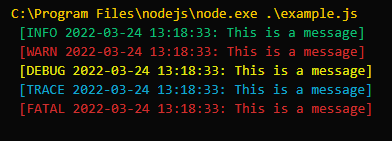

# openflixr-logger
Logging system for OpenFlixr3

## Usage

- Require the file or specify the functions to use
  `const { INFO, WARN, DEBUG, TRACE, FATAL} = require('openflixr-logger')`

- Run the functions
  `INFO("Message")`
  `WARN("Message")`
  `DEBUG("Message")`
  `TRACE("Message")`
  `FATAL("Message")`

Message is a required argument, it wil throw an error if it has not been specified.

### Output
The perpose of the logger is to display relevant messages on screen. All messages have an assigned colour, and they will present with the timestamp in the typeline.
